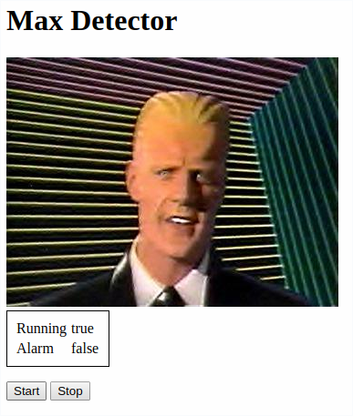

# maxdetector

This is the software part of a project that rings a bell whenever a specific
WiFi hotspot comes online.  The software consists of three parts:

- `maxdetector.py` is [MicroPython][] code that runs on an ESP8266, scans
  for the target networks, and raises a signal when it founds a target
  BSSID.

- `server.py` is [MicroPython][] that provides a web interface for 
  managing maxdetector from a browser.

- `src/maxdetector.cpp` is Arduino code (structured to compile with
  [Platformio][]) that watches for the signal from the ESP8266 and takes
  care of ringing a bell and implementing other UI elements.

[micropython]: https://micropython.org/
[platformio]: https://platformio.org/

## Building and installing the code

### Install the Micropython component

Use [ampy][] or a similar tool ([mpfshell][], [rshell][], etc) to upload
the code to your ESP8266. You will need to upload the following files
(preserving the directory structure):

[ampy]: https://github.com/scientifichackers/ampy
[mpfshell]: https://github.com/wendlers/mpfshell
[rshell]: https://github.com/dhylands/rshell

- `maxdetector.mpy`
- `server.mpy`
- `ui.html`
- `static/md.js`
- `static/style.css`
- `static/max.jpg`

You will need to create a `main.py` file (and upload it to the the ESP8266)
that configures things to start a boot. For example:

```
import esp
import gc
import maxdetector
import server

target_bssid = b'c0eefbe57190'

esp.osdebug(None)
gc.collect()

m = maxdetector.Monitor([target_bssid])
m.start()

s = server.Server(m)
s.start()
```

### Installing the Arduino component

After installing Platformio, just run:

```
pio run
```

Or to build and upload the code:

```
pio run -t upload
```

If you're Uno isn't on `/dev/ttyACM0` you will need to update the
`platformio.ini` file or specify a device path on the command line.

## Accessing the maxdetector web UI

In order to access the web interface you will need to configure the WiFi 
connection on your ESP8266. If you point your browser at your device's address,
you should see something like:



## Simulation

You can find a simulated version of the Arduino component [on Tinkercad][].

[on tinkercad]: https://www.tinkercad.com/things/cpRuevAoV5L-max-detector
